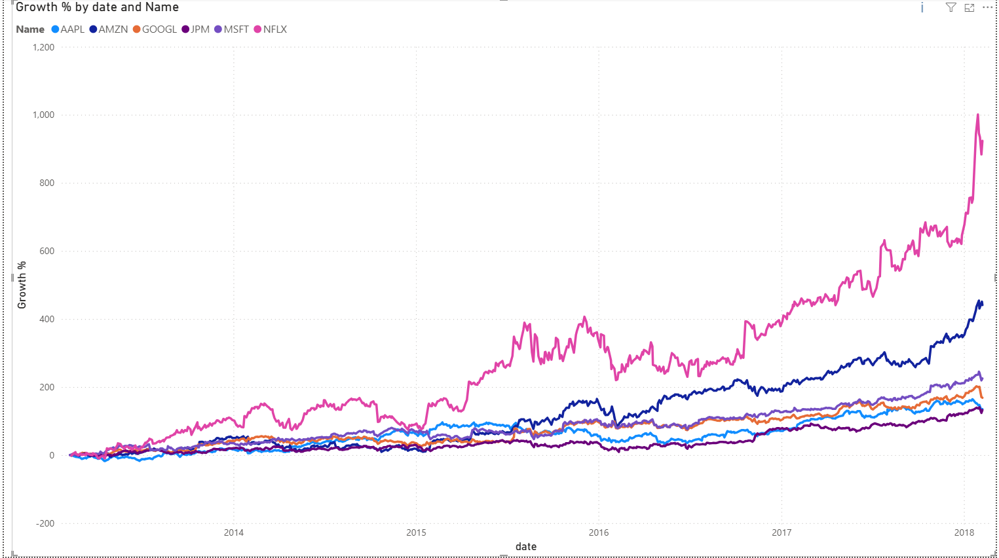
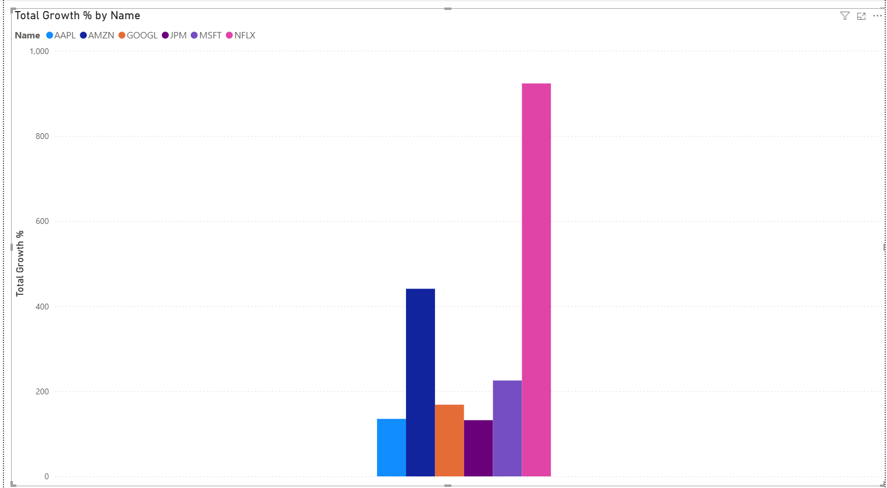
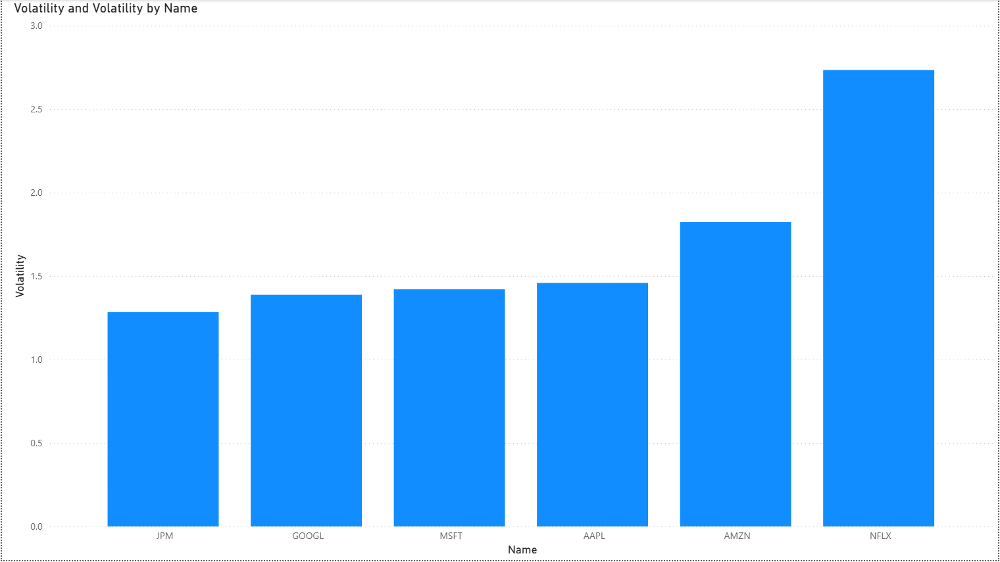

# 📈 Stock Market Performance & Volatility Analysis

Analysis of 5 years (2013–2018) of daily stock price data for six major companies — Apple, Amazon, Microsoft, Google, Netflix, and JPMorgan — using SQL, Python, and Power BI to explore growth, volatility, correlation, and the risk-return relationship between them.

## 🔑 Key Findings

- **Netflix delivered the highest growth (923%) and the highest volatility (2.74% average daily swing)** of the six stocks analyzed, while **JPMorgan showed the most stable price behavior (1.28% volatility) but the lowest growth (132%)** — consistent with the classic risk-return tradeoff seen across financial markets.
- **Netflix was also the most independently-moving stock**, with the lowest correlation to the other five tickers (0.23–0.35) — suggesting its performance was driven more by company-specific factors than broad market trends. Google and Amazon were the most closely correlated pair (0.55).
- Despite having a lower share price than Amazon or Google, **Apple had by far the highest trading volume (~54M shares/day)** — a reflection of shares outstanding rather than company value.
- **Raw price comparisons can be misleading.** Charting closing prices directly makes Google and Amazon look like the dominant performers, since their share prices are highest. Normalizing to percentage growth from a common starting point reveals the opposite: Netflix was the true outperformer.

## 📊 Interactive Dashboard (Power BI)

| Growth Over Time | Total Growth by Ticker | Volatility by Ticker |
|---|---|---|
|  |  |  |

Built in Power BI using custom DAX measures for growth percentage and volatility (standard deviation of daily returns), cross-validated against the Python/pandas calculations to confirm accuracy.

- 📄 [Full dashboard export (PDF)](dashboard_export.pdf)
- 📁 Power BI file: `stock_dashboard.pbix` (open with Power BI Desktop)

## 🛠️ Tools & Skills Used

- **SQL** (SQLite / DB Browser) — data querying, joins, subqueries, aggregate analysis
- **Python** (pandas, matplotlib) — data cleaning, daily returns, rolling averages, volatility (standard deviation), correlation analysis, visualization
- **Power BI** — interactive dashboard, custom DAX measures
- Git & GitHub for version control

## 📊 Dataset

[S&P 500 stock data (Kaggle)](https://www.kaggle.com/datasets/camnugent/sandp500) — daily OHLCV price data, 2013–2018, for all S&P 500 companies. This analysis focuses on a subset of 6 tickers: AAPL, AMZN, MSFT, GOOGL, NFLX, JPM.

*(Raw data files are not included in this repo — download from the Kaggle link above to reproduce.)*

## 📁 Project Structure

- `stock_analysis.ipynb` — main analysis notebook: data loading, cleaning, daily returns, volatility, correlation, visualization
- `stock_dashboard.pbix` — Power BI dashboard (open with Power BI Desktop)
- `dashboard_export.pdf` — exported dashboard, viewable without Power BI
- `growth_chart.png`, `total_growth_chart.png`, `volatility_chart.png` — dashboard screenshots
- `chart_raw_price.png`, `chart_growth_pct.png` — supporting Python/matplotlib charts
- `sql_queries.sql` — SQL exploration queries *(coming soon)*

## 🚀 About This Project

This is a self-directed learning project built while transitioning into data analytics after graduating with a BS in Computer Science. It's part of an ongoing portfolio documenting my progress from SQL/Python fundamentals through to interactive dashboard-building.

## 📌 Status

🟢 Active — Project 1 complete. Currently reviewing data analyst/data engineer job requirements ahead of applying.

---
*Built as part of a self-directed data analytics learning path.*